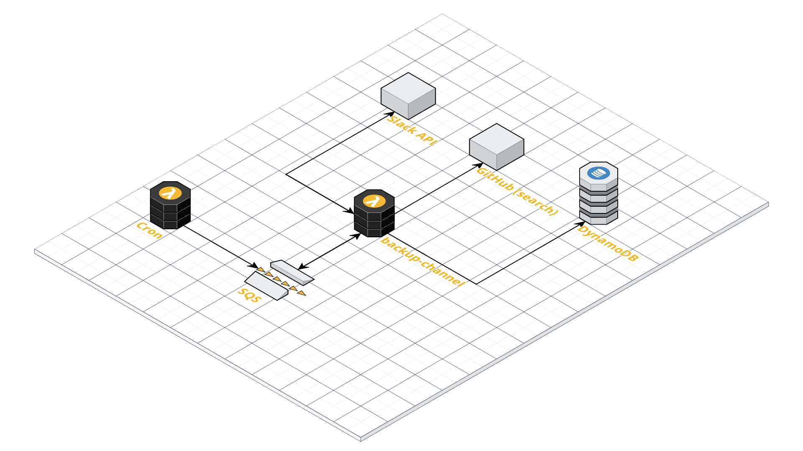

# Slackper

A set of functions that backups your Slack channels

It uses SQS to backpressure Slack's API (it has a [rate limit](https://api.slack.com/docs/rate-limits)) and stores the data in DynamoDB. It can also push the message history to Git so that text is searcheable through GitHub's search feature.

## Overview


## Deployment
You will need a YAML configuration file under the "config" directory with the following:

| Variable name | Variable value | Required |
|:-:|:-:|:-:|
| SLACK_TOKEN | a token you can get [here](https://api.slack.com/custom-integrations/legacy-tokens) | true |
| SLACK_CHANNEL | the channel name | true |
| AWS_DYNAMODB_TABLE | the name of your DynamoDB table | true |
| AWS_SQS | the name of your SQS | true |
| AWS_SQS_URL | the URL of your SQS | true |
| GITHUB_REMOTE | you can specify a remote | false |
| GITHUB_USER_EMAIL | the email for the user you are using to push to GitHub | false |
| GITHUB_USER | GitHub's user name | false |
| HOME | should be `/tmp` | true |

Check the [example.yml](config/example.yml) for more info.

After creating the required YAML file you can deploy the project running the following command
```
$ sls deploy -s yamlFile
```

## Debugging
You can invoke the backup locally simulating an SQS event by running

```
$ sls invoke localy -f backup-channel -s yamlFile -d '{ "Records": [{"body": "{\"latest\": 1551754800, \"startOfDay\": 1551668400}"}]  }'
```

You can also run it using the debugger wiht the following command
```
$ node --inspect ./node_modules/.bin/sls invoke local -f backup-channel -s yamlFile -d '{ "Records": [{"body": "{\"latest\": 1551754800, \"startOfDay\": 1551668400}"}]  }'
```


## Known issues
Re-deploying a specific function is currently not supported by the plugin `serverless-pseudo-parameters` for the function configuration this project has.
